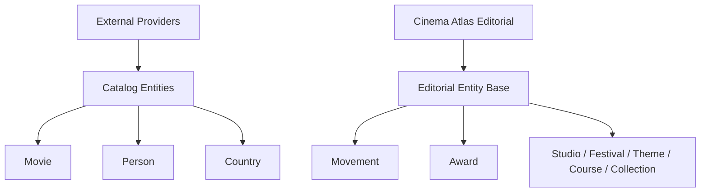
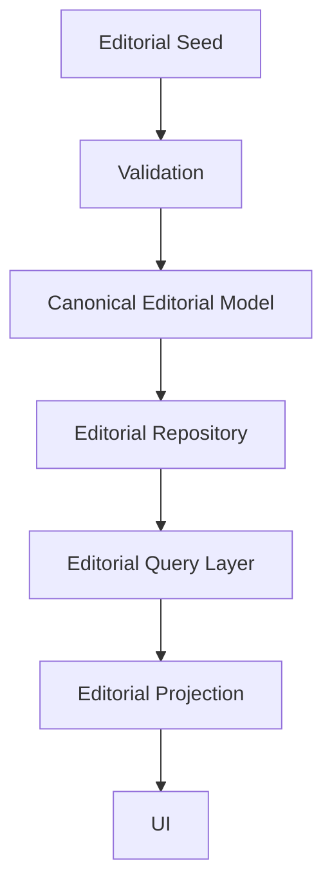

# Editorial Entity Foundation v1

## Purpose

Cinema Atlas distinguishes provider metadata from editorial knowledge.

- TMDB and other providers supply catalog metadata for movies, people, companies, countries, genres, and languages.
- Cinema Atlas owns editorial entities such as Movement, Award, Studio, Festival, Film History Event, Theme, Technique, Course, and Collection.

Editorial Entity Foundation v1 defines the shared base layer before Movement and Award persistence are implemented.

## Core Principle

Editorial entities are not TMDB entities. They belong to the Cinema Atlas Knowledge Layer.

## Folder Structure

`lib/editorial/` contains the foundation contracts:

- `metadata.ts`: status, source type, revision, timestamps, kind
- `relationships.ts`: shared curated relationship slugs and relationship records
- `entity.ts`: canonical editorial entity base and Movement/Award entity shapes
- `projection.ts`: UI-facing editorial projection base and Movement/Award projections
- `repository.ts`: shared repository contract for future persistence implementations
- `query.ts`: query service pattern for future Movement/Award integration
- `seedAdapters.ts`: type-safe adapters from current seed data into editorial entity/projection shapes
- `index.ts`: public exports

## Editorial Entity Base

Every editorial entity shares:

- `id`
- `slug`
- `kind`
- `name`
- `description`
- `whyItMatters`
- `status`
- `sourceType`
- `revision`
- `createdAt`
- `updatedAt`

Status values:

- `draft`
- `published`
- `archived`

Source values:

- `editorial`
- `external`
- `hybrid`

## Shared Relationships

Movement, Award, and future editorial entities use the same relationship field pattern:

- `movieSlugs`
- `directorSlugs`
- `actorSlugs`
- `countrySlugs`
- `relatedEntitySlugs`

This keeps Editorial relationships explicitly curated and separate from computed catalog edges.

## Movement and Award Fit

Movement uses the shared base plus:

- `period`
- `themes`
- `characteristics`
- `starterMovieSlug`

Award uses the shared base plus:

- `organization`
- `countrySlug`
- `foundedYear`
- `overview`
- `starterMovieSlug`

Both now have type-safe adapters from the current seed files.

## Repository Pattern

`EditorialRepository` defines the future persistence contract:

- `findAllPublished()`
- `findBySlug()`
- `exists()`
- `upsert()`
- `delete()`

Movement and Award repositories will specialize the same interface:

- `MovementRepository`
- `AwardRepository`

This sprint intentionally does not implement PostgreSQL persistence or migrations.

## Query Pattern

The future Query Layer should expose UI-safe methods:

- `getMovements()`
- `getMovementBySlug()`
- `getAwards()`
- `getAwardBySlug()`

Pages should call Query Layer methods, not repositories.

## Projection Rules

Editorial projections must include:

- `slug`
- `kind`
- `name`
- `description`
- `whyItMatters`
- `status`
- `sourceType`
- shared relationship fields

Projection creation should resolve only UI-safe fields. Persistence details and provider-specific data should not leak to pages.

## Life Cycle

## Out of Scope

This sprint does not implement:

- Movement Repository
- Award Repository
- PostgreSQL migrations
- Seed import
- UI migration
- Search
- Recommendation

## Foundation Report

The foundation is ready when Movement and Award can be represented through the same base contracts without duplicating repository, metadata, relationship, and projection patterns.

Next sprint can implement Movement and Award persistence by specializing the shared contracts instead of inventing separate entity architectures.