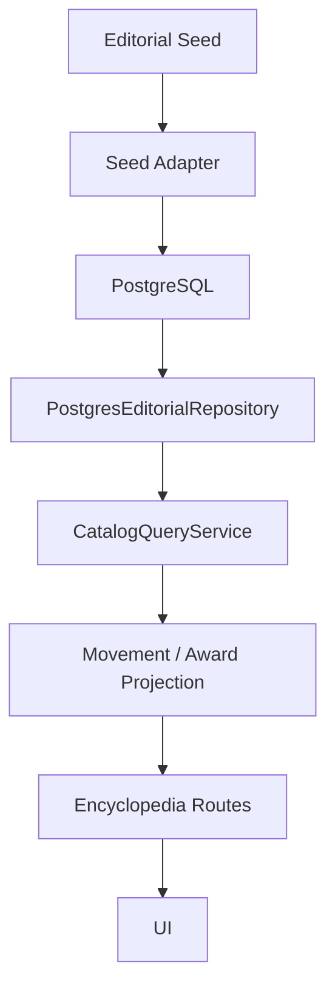

# Editorial Persistence v1

## Purpose

Editorial Persistence v1 stores Cinema Atlas editorial entities in PostgreSQL and exposes them through the existing Query Layer.

This sprint covers:

- Movement persistence
- Award persistence
- Editorial relationship persistence through `knowledge_graph_edges`
- Seed import from current editorial seed data
- Repository-backed Movement/Award encyclopedia routes

## Data Flow



## Tables

### `catalog_movements`

Stores canonical editorial movement records:

- `id`
- `slug`
- `name`
- `description`
- `why_it_matters`
- `status`
- `source_type`
- `revision`
- `era_label`
- `start_year`
- `end_year`
- `characteristics`
- `themes`
- `starter_movie_slug`
- `created_at`
- `updated_at`

### `catalog_awards`

Stores canonical editorial award records:

- `id`
- `slug`
- `name`
- `description`
- `why_it_matters`
- `status`
- `source_type`
- `revision`
- `organization`
- `award_type`
- `country_slug`
- `founded_year`
- `overview`
- `starter_movie_slug`
- `created_at`
- `updated_at`

## Relationships

Editorial relationships reuse `knowledge_graph_edges`.

Movement and Award relations are curated and slug-based:

- Movement -> Movie
- Movement -> Director
- Movement -> Country
- Movement -> Related Movement
- Award -> Movie
- Award -> Director
- Award -> Country

The relationship source uses:

- `source_type = movement | award`
- `source_id = editorial slug`
- `is_curated = true`

## Repository

`PostgresEditorialRepository` implements the shared `EditorialRepository` contract:

- `findAllPublished()`
- `findBySlug()`
- `exists()`
- `upsert()`
- `replaceRelationships()`
- `delete()`

The repository owns SQL only. Projection happens in `CatalogQueryService`.

## Query Integration

`CatalogQueryService` now exposes:

- `getMovements()`
- `getMovementBySlug()`
- `getAwards()`
- `getAwardBySlug()`

The Movement and Award encyclopedia routes call Query Layer functions only.

## Static Data Policy

`data/movements.ts` and `data/awards.ts` are now editorial seed sources and development fallback data. They are not canonical UI sources when PostgreSQL is configured.

## Commands

```bash
npm run db:migrate
npm run seed:editorial
npm run verify:editorial
```

## Verification Result

The verification script checks:

- at least two Movement slug lookups
- at least two Award slug lookups
- Movement relationship edges
- Award relationship edges
- duplicate Movement slugs = 0
- duplicate Award slugs = 0

## Out of Scope

This sprint does not implement:

- Wikipedia import
- Wikidata import
- TMDB editorial import expansion
- Search
- Recommendation
- AI Editorial
